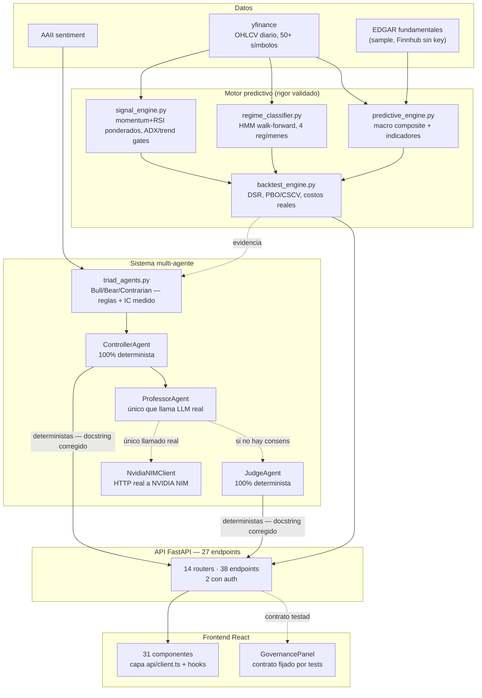

# Auditoría técnica integral — fortress_core

Revisión de código, agentes, API, frontend, testing, seguridad, datos e infraestructura,
verificada contra el repositorio real (2026-08-12) — no contra README ni reportes previos.

> **SYNC 2026-08-23 (Cline, coordinación Orca):** cada sección fue re-verificada contra el código
> real (grep/lectura directa, no confiar en este texto viejo). Lo cerrado lleva ✅ y cita commit o
> fila de `ROADMAP.md`. Lo que sigue abierto se dejó tal cual porque sigue siendo cierto.
Complementa `PLAN_MEJORA_MATEMATICA.md` (motor predictivo/matemática) y
`RESUMEN_VALIDACION_VARIABLES.md`, que cubren en detalle la parte de investigación.

Metodología: mapeo amplio vía agente Explore + verificación directa (grep/lectura de código,
`gh api`, corrida real de `pytest`) de los hallazgos más consecuentes antes de reportarlos.

---

## Estado de un vistazo

| Dominio | Estado |
|---|---|
| Motor predictivo / matemática | 🟢 rigor excelente |
| Señal comercial en vivo | 🔴 ninguna verificada |
| Sistema multi-agente | 🟢 docstrings corregidos (Tanda A, `a56e516`) |
| API / backend | 🟡 2 endpoints con auth + rate limit; resto sin auth = decisión de producto pendiente |
| Frontend | 🟢 contrato GovernancePanel fijado por tests backend + frontend |
| Testing | 🟢 backend 358 passed + frontend 17 tests (antes: 70 y cero) |
| Seguridad | 🟡 rate limit y backup DB agregados; SECRET_KEY default y auth parcial siguen |
| Infra / deploy | 🟢 CI activo (ruff+pytest), Python Dockerfile = venv (3.9) |
| Documentación | 🟢 README corregido (Tanda A); esta auditoría sincronizada 2026-08-23 |
| Datos | 🟡 única fuente gratuita |

---

## 1. Resumen ejecutivo

1. **El rigor matemático es lo mejor del proyecto, por lejos.** DSR, PBO/CSCV, RMT, rank IC
   intra-día con Newey-West, pre-registro y reversión automática — nivel de casa cuantitativa
   seria. Es la parte que hay que proteger, no tocar el proceso.
2. **Ese mismo rigor concluyó que hoy no hay señal comercial.** Las tres ramas de
   selección/timing sobre 50 símbolos se descartaron con evidencia.
3. **El sistema multi-agente es real pero se miente a sí mismo en la documentación.**
   Controller y Judge están marcados como deterministas en el propio código, pero la tabla de
   modelos LLM del docstring dice que usan DeepSeek/GLM. Sólo Professor llama efectivamente a
   un LLM. **✅ CERRADO — docstrings corregidos (Tanda A, commit `a56e516`).**
4. **La superficie API es prácticamente pública** (en la auditoría: 25 de 27; hoy 36 de 38).
   Endpoints sin control de acceso, comparación de API key no tiempo-constante, y el default de `SECRET_KEY` en código
   es `"change-me-in-production"` — mitigado en este entorno porque el `.env` real lo
   sobreescribe, pero es una trampa para cualquier despliegue nuevo.
   *Sync 2026-08-23*: sigue siendo cierto y es **decisión de producto, no bug**. La superficie
   creció a 38 endpoints en 14 routers (antes 27 en 8) y la auth no siguió el ritmo (siguen 2).
   Rate limit agregado en Tanda B (`217eb51`).
5. **Hay un bug de contrato silencioso en producción.** El panel de gobernanza del frontend
   espera campos que el backend no envía — no crashea, simplemente muestra "RECHAZADO" y
   "undefined" siempre. Cero tests lo hubieran atrapado. **✅ CERRADO — contrato corregido y
   fijado por `backend/tests/test_governance_contract.py` + 17 tests de frontend (`7c154f2`).**

---

## 2. Arquitectura y flujo real



---

## 3. Motor predictivo y validación matemática

Ya auditado exhaustivamente en `PLAN_MEJORA_MATEMATICA.md` / `RESUMEN_VALIDACION_VARIABLES.md`
— se resume acá para que este informe sea autocontenido.

**Bueno — aparato estadístico**: DSR con corrección por `n_trials`, PBO/CSCV, rank IC
intra-día con Newey-West (corrigiendo el error clásico de pooled vs cross-sectional),
RMT/Marchenko-Pastur con remoción del factor de mercado, purged/embargo CV, pre-registro de
criterio antes de correr, reversión automática si no se cumple. Nivel comparable a literatura
académica.

**Resultado — sin señal comercial verificada hoy**: selección de 50 símbolos descartada
(3 fuentes independientes); rotación sectorial descartada (diagnóstico endógeno RMT); timing
sobre basket único con ADX descartado dos veces (DSR y re-evaluación con metodología
correcta). Gap-reversion intra-día: el hallazgo estadístico más fuerte del proyecto, pero
inoperable sin motor de ejecución intradía inexistente.

**En curso — pivot a gestión de riesgo**: régimen vs volatilidad realizada es una pista sin
confirmar (no sobrevive Bonferroni-4). `TARGET_VOLATILITY` existe en `config.py` sin conectar
— correctamente, dado que la evidencia que lo justificaría no cerró todavía.

---

## 4. Sistema multi-agente / gobernanza

**✅ CERRADO (Tanda A, `a56e516`) — hallazgo original:** ⚠️ Controller y Judge nunca llaman a un LLM. El docstring y `GOVERNANCE_LLM_MODELS`
afirman que Controller usa "DeepSeek V4 Flash" y Judge "GLM 5.2". El código dice lo
contrario, explícito en el propio comentario:

```python
"llm_model": None,  # CONTROLLER es 100% determinista, nunca llama a un LLM
```

Sólo **Professor** ejecuta una llamada real. No es necesariamente un error de diseño (un
juez/controlador determinista puede ser la decisión correcta por confiabilidad), pero la
documentación que dice lo contrario sí es un problema de integridad.
*Verificado: `advanced_agents.py` líneas 594, 599, 646, 670.*

**Bueno — `triad_agents.py` no es teatro.** BullAgent/BearAgent/ContrarianAgent usan reglas
donde varias tienen `weight=0` o signo invertido explícitamente porque el IC medido salió
negativo o sin efecto — señal real de validación estadística, no números elegidos a mano.

**✅ RESUELTO — `prompt_engine.py` fue ELIMINADO (ver ROADMAP): `HardinessChecker` extraído
intacto a `app/core/hardiness.py` con sus tests portados (`tests/test_hardiness.py`, incluye la
regresión del bug latente de `self_consistency`). Hallazgo original:** 🔴 659 líneas sin uso, con bug incluido. `PromptEngine`,
`MemorySystem`, `GOD_LEVEL_PROMPTS` no se importan desde ningún lado (verificado con grep
sobre `app/` y tests). Los prompts reales en producción están duplicados dentro de
`advanced_agents.py`. `PromptEngine.self_consistency()` (línea 647) referencia una variable
`mean` nunca definida — lanzaría `NameError` si se llamara. Inofensivo porque nunca se
ejecuta, pero confirma cero cobertura.

**Ineficiente**: `GovernanceSystem`, `KnowledgeRepository`, `RAGMemorySystem` se instancian de
nuevo en casi cada endpoint de `governance.py`, releyendo JSON cada vez — sin caché ni control
de concurrencia.

---

## 5. Datos

| Fuente | Estado | Nota |
|---|---|---|
| yfinance (OHLCV) | única fuente | Gratis, ~15-20min delayed, sin garantía de ausencia de sesgo de supervivencia |
| Macro (DXY/gold/oil/SPY/TLT) | corregido | Faltaban tickers exactos — corregido en Fase -1.2 |
| AAII sentiment | conectado | Disponible 2913/2913 días de trading |
| Fundamentales (EDGAR) | parcial | `FINNHUB_API_KEY` vacío → degrada a sample de 6 tickers |
| Datos alternativos/intradía | no existe | Bloquea cualquier estrategia de frecuencia corta |

---

## 6. API / backend

**✅ CERRADO / RE-VERIFICADO EN CÓDIGO (2026-08-24, Brecha 5 handover §6.2, Cline)**:
la superficie de ESCRITURA está 2/2 con auth — los únicos endpoints no-GET de toda la
API son `POST /governance/record-prediction` y `POST /governance/knowledge/add`, ambos
con `verify_api_key` (`hmac.compare_digest` contra `settings.SECRET_KEY`, governance.py:37)
desde el cierre P0 del 2026-08-12. El "default inseguro" `change-me-in-production`
(config.py:8) está BLOQUEADO fuera de development por el model_validator
`_require_secure_secret_key` (config.py:75-84) con test
`test_secret_key_default_blocked_outside_development` — vigente y pasando. El conteo
"36/38 sin acceso" cuenta endpoints GET de LECTURA: abiertos POR DECISIÓN de producto
(UI pública). INVARIANTE fijado hacia adelante: `tests/test_api_write_auth.py` (3 tests,
incluye control de inventario) falla la suite si aparece cualquier endpoint de escritura
sin `verify_api_key`. Nota: el módulo `opportunities_universe.py` NO es un router (no
define endpoints; es la lista canónica del universo 50).

**Era (lectura de la auditoría externa, desactualizada contra el código)**: 🟡 36 de 38
endpoints sin control de acceso; sólo los 2 POST con `X-API-Key`; default de `SECRET_KEY`
en `config.py`: `"change-me-in-production"` sin validación.

*Sync 2026-08-23*: rate limit por IP agregado a los GET que disparan LLM real (`app/api/rate_limit.py`, Tanda B `217eb51`, con tests).

**✅ CERRADO (ronda 2026-08-12, ROADMAP «Fix except desnudo + errores como 200 OK»; re-verificado hoy por grep: `live.py` sólo tiene `except` tipados o con manejo, cero `except:` desnudos). Era:** 🔴 `market.py` y `live.py` capturan excepciones y devuelven `200 OK` con `{"error": str(e)}` en el body; `live.py:53` tenía un `except:` desnudo.

**✅ CERRADO — re-verificado hoy: las 4 rutas usan `download_data(symbol, "2015-01-01")` SIN fecha
de fin fija (fin = hoy implícito; el arranque 2015 es histórico intencional). Era:** ⚠️ fecha de fin fija "2024-12-31" que congelaba el dashboard a mediados de 2024.

**Cobertura por router (sync 2026-08-23)** — la tabla original de manejo de errores quedó
obsoleta: los fixes se cerraron en la ronda 2026-08-12 y HOY cada router principal tiene tests
de integración en `backend/tests/`. Total actual: **38 endpoints en 14 módulos bajo `routes/`**
(advisor, backtest, costs, decision, decision_history, governance, live, market, opportunities,
opportunities_universe, predict, ranking, risk, system — los últimos cuatro y costs son nuevos
post-auditoría).

| Router | Tests de integración | Auth |
|---|---|---|
| advisor | ✅ `test_advisor_api.py` | — |
| backtest | ✅ `test_backtest_api.py` | — |
| costs | ✅ `test_costs_api.py` | — |
| governance | ✅ ×3 (`test_governance_auth/contract/api`) | 2 POST con `X-API-Key` |
| live | ✅ `test_live_api.py` | — |
| market | ✅ `test_market_api.py` | — |
| opportunities | ✅ `test_opportunities_api.py` | — |
| predict | ✅ `test_predict_api.py` | — |
| risk | ✅ `test_risk_api.py` | — |
| system | ✅ `test_system_api.py` | — |

---

## 7. Frontend

React 18 + TypeScript + Vite + Tailwind + Recharts.

*Sync 2026-08-23*: **31 componentes TSX** organizados en `components/` + `advisor/` + `views/`,
con capa de datos dedicada (`src/api/client.ts`, tipos por endpoint + `hooks.ts`).
**17 tests de frontend** con Vitest 2 + React Testing Library 16 (commit `7c154f2`) — antes cero:
GovernancePanel (7, contrato), CostField (4, honestidad M4), hooks advisor (6). Scripts `npm test`
/ `npm run test:watch`; el build (`tsc && vite build`) tipa también los tests.

**✅ CERRADO — corregido y blindado por `test_governance_contract.py` (backend) y 7 tests de
contrato en frontend (`7c154f2`). Hallazgo original:** 🔴 GovernancePanel esperaba un contrato que el backend no envía. Frontend espera
`governance.triad_consensus`, `governance.controller_approved`, `governance.judge_verdict`.
Backend envía `governance.triad`, `governance.controller.approved`, `governance.judge.verdict`
— nombres y anidamiento distintos. Efecto: el bloque TRIAD nunca renderiza, Controller siempre
muestra "RECHAZADO", el texto del Juez imprime literalmente `undefined`. No crashea — por eso
nadie lo notó. TypeScript no lo atrapa porque `fetch().then(r => r.json())` tipa como `any`.
*Verificado: `GovernancePanel.tsx` líneas 8-32 vs `advanced_agents.py` líneas 570-675.*

**✅ RESUELTO — `client.ts` centraliza la URL vía `VITE_API_URL` (fallback `localhost:8000`);
`SystemStatus.tsx` y `RiskPanel.tsx` hoy reciben la prop `apiUrl`. Era:** ⚠️ URL hardcodeada en `App.tsx` y fetch propio en SystemStatus/RiskPanel.

---

## 8. Testing

*[Sección reescrita 2026-08-23]*

- **Backend**: ~39 archivos de test; suite **358 passed** (reportada verificada en el repo real por
  Claude Code, 2026-08-23). Invocación canónica: `cd backend && .venv/bin/python -m pytest`
  (desde la raíz se cuelga — config en `backend/pytest.ini`).
- **Cobertura nueva vs. la foto del 12-08** (13 archivos, todo "core", 7/8 routers sin cubrir):
  hoy hay integración para los 10 routers principales (ver tabla §6), más auth, rate limit,
  costos, execution costs, trial registry y hardiness (portado de `prompt_engine.py`, que fue
  **eliminado** — ver §4).
- **Frontend**: **17 tests** Vitest+RTL (commit `7c154f2`) — antes cero. Detalle en §7.

---

## 9. Seguridad

| Hallazgo | Severidad | Estado |
|---|---|---|
| Endpoints sin autenticación (36/38 hoy) | alta | abierto — decisión de producto, NO bug |
| Default `SECRET_KEY` inseguro en código | media | mitigado por .env local, código sigue mal |
| Comparación de API key no tiempo-constante | baja | abierto |
| Sin rate-limiting | media | ✅ CERRADO (Tanda B, `217eb51`) — ventana deslizante por IP en predict/analyze y governance/analyze, con tests |
| Repo público en GitHub | contexto | confirmado (bjofrea-ctrl/fortress_core) |
| Token QuantConnect expuesto en chat | — | resuelto, rotado |
| Credenciales LEAN | — | correcto, fuera del repo, verificado con `gh api` |

---

## 10. Infraestructura y deploy

- ✅ **CERRADO (Tanda A, `a56e516`)**: `Dockerfile` fijado a `python:3.9-slim` = `.venv` real (3.9.6). Era: Python 3.11 vs 3.9.6.
- ✅ **CERRADO**: `.github/workflows/ci.yml` activo (ruff + pytest). Era: sin CI/CD ni checks en push.
- ✅ **CERRADO (Tanda A)**: mención de Redis removida del README. Era: Redis documentado que no existía.
- ➕ **Nuevo (Tanda B, `217eb51`)**: backup específico de `fortress.db` vía `sqlite3 .backup` en
  `auto_backup.sh` / `backup.sh` (retención 20 snapshots). Despliegue permanente vía launchd
  (ROADMAP 2026-08-20): API :8000 + dashboard http://localhost:3000 + data updater 22:00.
- **Bueno**: flujo de auto-backup + commit descriptivo encima cumplió su función durante toda
  esta investigación — nunca se perdió trabajo, aunque el historial de git queda ruidoso.

---

## 11. Documentación

Conviven dos culturas muy distintas: `PLAN_MEJORA_MATEMATICA.md` /
`RESUMEN_VALIDACION_VARIABLES.md` son ejemplares (pre-registro, veredictos con artefacto
citado, correcciones documentadas). `README.md` fue **corregido en Tanda A (`a56e516`)** — versión 3.9, sin Redis, tabla completa de
endpoints vigente a esa fecha (hoy son 38 en 14 routers; revisar en próxima pasada de docs).

---

## 12. Academia y conocimiento

`KnowledgeRepository` es un RAG básico (~20 entradas hardcodeadas, similitud Jaccard, sin
embeddings) — muy por debajo del rigor estadístico real del proyecto. El contraste vale la
pena nombrarlo: el rigor de verdad está en el trabajo de investigación (DSR/PBO/RMT/Newey-West
con citas verificadas), no en el RAG. Y el caso contrario también quedó documentado esta misma
sesión: un informe citó un repo de GitHub de 0 estrellas como si fueran datos reales del
Medallion Fund — se verificó y descartó antes de construir nada. Esa disciplina de verificar
la fuente es el activo más valioso del proyecto.

---

## 13. Hardware y recursos reales

Mac personal + VPS chica + disco externo de 3TB. Alcanza sobrado para OHLCV diario de todo el
universo de acciones de EEUU durante décadas, para el aparato estadístico actual, y para un
cron diario de screening/papertrading. No alcanza para datos intradía/tick, ejecución de baja
latencia, ni cómputo distribuido — coherente con la decisión de priorizar gestión de riesgo
sobre búsqueda de alfa de alta frecuencia.

---

## 14. Qué hacer primero

| Prioridad | Acción | Por qué | Esfuerzo |
|---|---|---|---|
| ~~P0~~ ✅ | Arreglar contrato GovernancePanel ↔ backend | Cerrado — `test_governance_contract.py` + tests frontend (`7c154f2`) | hecho |
| ~~P0~~ ✅ | `except:` desnudo + errores como 200 OK en market/live | Cerrado ronda 12-08; re-verificado grep 23-08 | hecho |
| **P0 ABIERTO** | Auth mínima global + comparación tiempo-constante + fallar si `SECRET_KEY` no está seteado | **Decisión de producto** — 36/38 endpoints abiertos en repo público; requiere a Boris | medio |
| ~~P1~~ ✅ | Fechas fijas de `market.py` | Cerrado — fecha de fin dinámica verificada 23-08 | hecho |
| ~~P1~~ ✅ | Alinear Python Dockerfile ↔ venv | Cerrado Tanda A `a56e516` | hecho |
| ~~P1~~ ✅ | Corregir README (Redis, versión, endpoints) | Cerrado Tanda A | hecho |
| ~~P1~~ ✅ | Corregir docstring Controller/Judge | Cerrado Tanda A | hecho |
| ~~P2~~ ✅ | Tests de integración routers (+17 de frontend) | Cerrado — suite 358 passed + frontend 17 | hecho |
| ~~P2~~ ✅ | Destino de `prompt_engine.py` | Cerrado — ELIMINADO; hardiness extraído a `app/core/hardiness.py` | hecho |
| ~~P2~~ ✅ | CI básico (lint + test en push) | Cerrado — `.github/workflows/ci.yml` | hecho |
| Mantener | El protocolo de investigación matemática tal cual está | Es lo mejor del proyecto | — |
