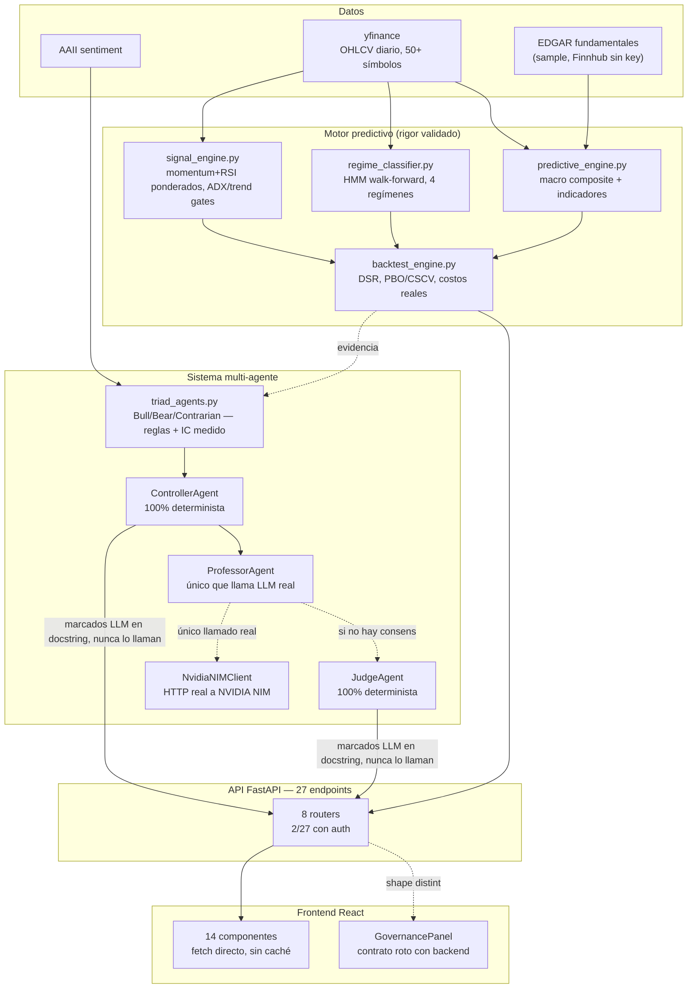

# Auditoría técnica integral — fortress_core

Revisión de código, agentes, API, frontend, testing, seguridad, datos e infraestructura,
verificada contra el repositorio real (2026-08-12) — no contra README ni reportes previos.
Complementa `PLAN_MEJORA_MATEMATICA.md` (motor predictivo/matemática) y
`RESUMEN_VALIDACION_VARIABLES.md`, que cubren en detalle la parte de investigación.

Metodología: mapeo amplio vía agente Explore + verificación directa (grep/lectura de código,
`gh api`, corrida real de `pytest`) de los hallazgos más consecuentes antes de reportarlos.

---

## Estado de un vistazo

| Dominio | Estado |
|---|---|
| Motor predictivo / matemática | 🟢 rigor excelente |
| Señal comercial en vivo | 🔴 ninguna verificada |
| Sistema multi-agente | 🟡 parcial, mal documentado |
| API / backend | 🔴 casi sin auth |
| Frontend | 🟡 un panel roto en silencio |
| Testing | 🟡 70/70 pasan, cobertura despareja |
| Seguridad | 🔴 default inseguro, repo público |
| Infra / deploy | 🟡 sin CI/CD, versión inconsistente |
| Documentación | 🟡 desactualizada en partes |
| Datos | 🟡 única fuente gratuita |

---

## 1. Resumen ejecutivo

1. **El rigor matemático es lo mejor del proyecto, por lejos.** DSR, PBO/CSCV, RMT, rank IC
   intra-día con Newey-West, pre-registro y reversión automática — nivel de casa cuantitativa
   seria. Es la parte que hay que proteger, no tocar el proceso.
2. **Ese mismo rigor concluyó que hoy no hay señal comercial.** Las tres ramas de
   selección/timing sobre 50 símbolos se descartaron con evidencia.
3. **El sistema multi-agente es real pero se miente a sí mismo en la documentación.**
   Controller y Judge están marcados como deterministas en el propio código, pero la tabla de
   modelos LLM del docstring dice que usan DeepSeek/GLM. Sólo Professor llama efectivamente a
   un LLM.
4. **La superficie API es prácticamente pública.** 25 de 27 endpoints sin ningún control de
   acceso, comparación de API key no tiempo-constante, y el default de `SECRET_KEY` en código
   es `"change-me-in-production"` — mitigado en este entorno porque el `.env` real lo
   sobreescribe, pero es una trampa para cualquier despliegue nuevo.
5. **Hay un bug de contrato silencioso en producción.** El panel de gobernanza del frontend
   espera campos que el backend no envía — no crashea, simplemente muestra "RECHAZADO" y
   "undefined" siempre. Cero tests lo hubieran atrapado.

---

## 2. Arquitectura y flujo real



---

## 3. Motor predictivo y validación matemática

Ya auditado exhaustivamente en `PLAN_MEJORA_MATEMATICA.md` / `RESUMEN_VALIDACION_VARIABLES.md`
— se resume acá para que este informe sea autocontenido.

**Bueno — aparato estadístico**: DSR con corrección por `n_trials`, PBO/CSCV, rank IC
intra-día con Newey-West (corrigiendo el error clásico de pooled vs cross-sectional),
RMT/Marchenko-Pastur con remoción del factor de mercado, purged/embargo CV, pre-registro de
criterio antes de correr, reversión automática si no se cumple. Nivel comparable a literatura
académica.

**Resultado — sin señal comercial verificada hoy**: selección de 50 símbolos descartada
(3 fuentes independientes); rotación sectorial descartada (diagnóstico endógeno RMT); timing
sobre basket único con ADX descartado dos veces (DSR y re-evaluación con metodología
correcta). Gap-reversion intra-día: el hallazgo estadístico más fuerte del proyecto, pero
inoperable sin motor de ejecución intradía inexistente.

**En curso — pivot a gestión de riesgo**: régimen vs volatilidad realizada es una pista sin
confirmar (no sobrevive Bonferroni-4). `TARGET_VOLATILITY` existe en `config.py` sin conectar
— correctamente, dado que la evidencia que lo justificaría no cerró todavía.

---

## 4. Sistema multi-agente / gobernanza

**⚠️ Controller y Judge nunca llaman a un LLM.** El docstring y `GOVERNANCE_LLM_MODELS`
afirman que Controller usa "DeepSeek V4 Flash" y Judge "GLM 5.2". El código dice lo
contrario, explícito en el propio comentario:

```python
"llm_model": None,  # CONTROLLER es 100% determinista, nunca llama a un LLM
```

Sólo **Professor** ejecuta una llamada real. No es necesariamente un error de diseño (un
juez/controlador determinista puede ser la decisión correcta por confiabilidad), pero la
documentación que dice lo contrario sí es un problema de integridad.
*Verificado: `advanced_agents.py` líneas 594, 599, 646, 670.*

**Bueno — `triad_agents.py` no es teatro.** BullAgent/BearAgent/ContrarianAgent usan reglas
donde varias tienen `weight=0` o signo invertido explícitamente porque el IC medido salió
negativo o sin efecto — señal real de validación estadística, no números elegidos a mano.

**🔴 `prompt_engine.py` — 659 líneas sin uso, con bug incluido.** `PromptEngine`,
`MemorySystem`, `GOD_LEVEL_PROMPTS` no se importan desde ningún lado (verificado con grep
sobre `app/` y tests). Los prompts reales en producción están duplicados dentro de
`advanced_agents.py`. `PromptEngine.self_consistency()` (línea 647) referencia una variable
`mean` nunca definida — lanzaría `NameError` si se llamara. Inofensivo porque nunca se
ejecuta, pero confirma cero cobertura.

**Ineficiente**: `GovernanceSystem`, `KnowledgeRepository`, `RAGMemorySystem` se instancian de
nuevo en casi cada endpoint de `governance.py`, releyendo JSON cada vez — sin caché ni control
de concurrencia.

---

## 5. Datos

| Fuente | Estado | Nota |
|---|---|---|
| yfinance (OHLCV) | única fuente | Gratis, ~15-20min delayed, sin garantía de ausencia de sesgo de supervivencia |
| Macro (DXY/gold/oil/SPY/TLT) | corregido | Faltaban tickers exactos — corregido en Fase -1.2 |
| AAII sentiment | conectado | Disponible 2913/2913 días de trading |
| Fundamentales (EDGAR) | parcial | `FINNHUB_API_KEY` vacío → degrada a sample de 6 tickers |
| Datos alternativos/intradía | no existe | Bloquea cualquier estrategia de frecuencia corta |

---

## 6. API / backend

**🔴 25 de 27 endpoints sin ningún control de acceso.** Sólo `POST
/governance/record-prediction` y `POST /governance/knowledge/add` requieren `X-API-Key`,
comparado con string directa (no `secrets.compare_digest`). Default de `SECRET_KEY` en
`config.py`: `"change-me-in-production"`. En este entorno el `.env` real lo sobreescribe
(verificado sin exponer el valor), pero el código debería fallar al arrancar si no se
configuró.

**🔴 Errores devueltos como 200 OK.** `market.py` y `live.py` capturan excepciones y devuelven
`200 OK` con `{"error": str(e)}` en el body. `live.py:53` tiene un `except:` desnudo.

**⚠️ `market.py` sirve datos fijos a fines de 2024.** Las 4 rutas de `/api/market/*` usan
`download_data(symbol, "2015-01-01", "2024-12-31")` con fecha de fin fija — hoy ese dashboard
muestra el mercado congelado hace año y medio, mientras `opportunities.py` sí está actualizado
a mano y `predict.py`/`governance.py` usan la fecha de hoy implícita.

| Router | Endpoints | Auth | Manejo de errores |
|---|---|---|---|
| backtest | 5 | — | sin captura, 500 no controlado |
| governance | 8 | 2/8 con API key | correcto |
| live | 2 | — | 200 OK con error en body, `except:` desnudo |
| market | 5 | — | 200 OK con error en body, fechas fijas 2024 |
| opportunities | 1 | — | correcto |
| predict | 3 | — | correcto |
| risk | 1 | — | — |
| system | 1 | — | — |

---

## 7. Frontend

React 18 + TypeScript + Vite + Tailwind + Recharts. 14 componentes, ~1962 líneas TSX, plano
en `src/components/`. Sin librería de data-fetching, sin caché. **Cero tests de frontend.**

**🔴 GovernancePanel espera un contrato que el backend no envía.** Frontend espera
`governance.triad_consensus`, `governance.controller_approved`, `governance.judge_verdict`.
Backend envía `governance.triad`, `governance.controller.approved`, `governance.judge.verdict`
— nombres y anidamiento distintos. Efecto: el bloque TRIAD nunca renderiza, Controller siempre
muestra "RECHAZADO", el texto del Juez imprime literalmente `undefined`. No crashea — por eso
nadie lo notó. TypeScript no lo atrapa porque `fetch().then(r => r.json())` tipa como `any`.
*Verificado: `GovernancePanel.tsx` líneas 8-32 vs `advanced_agents.py` líneas 570-675.*

**⚠️ URL del backend hardcodeada.** `App.tsx` define `API_URL = "http://localhost:8000"` fijo.
`SystemStatus.tsx` y `RiskPanel.tsx` ni siquiera reciben la prop — hardcodean su propio fetch.

---

## 8. Testing

**🟢 70 passed, 0 failed** — corrido directamente en esta auditoría (`pytest -q`, 7.42s), no
heredado de un reporte anterior.

**⚠️ Cobertura despareja.** 13 archivos de test, todos sobre módulos "core". Cero cobertura
sobre `advanced_agents.py`, `knowledge_repo.py`, `prompt_engine.py`, ni 7 de los 8 routers
FastAPI. El bug de §7 es exactamente lo que un test de integración API↔frontend hubiera
atrapado en minutos.

---

## 9. Seguridad

| Hallazgo | Severidad | Estado |
|---|---|---|
| 25/27 endpoints sin autenticación | alta | abierto |
| Default `SECRET_KEY` inseguro en código | media | mitigado por .env local, código sigue mal |
| Comparación de API key no tiempo-constante | baja | abierto |
| Sin rate-limiting | media | abierto |
| Repo público en GitHub | contexto | confirmado (bjofrea-ctrl/fortress_core) |
| Token QuantConnect expuesto en chat | — | resuelto, rotado |
| Credenciales LEAN | — | correcto, fuera del repo, verificado con `gh api` |

---

## 10. Infraestructura y deploy

- **Python 3.11 en Dockerfile, 3.9.6 en el `.venv` real** — riesgo de "funciona en mi máquina".
- **Sin CI/CD** — repo público sin `.github/workflows` ni ningún check automático en push.
- **Redis documentado, no existe en el código** — `docker-compose.yml` sólo tiene db/backend/frontend.
- **Bueno**: flujo de auto-backup + commit descriptivo encima cumplió su función durante toda
  esta investigación — nunca se perdió trabajo, aunque el historial de git queda ruidoso.

---

## 11. Documentación

Conviven dos culturas muy distintas: `PLAN_MEJORA_MATEMATICA.md` /
`RESUMEN_VALIDACION_VARIABLES.md` son ejemplares (pre-registro, veredictos con artefacto
citado, correcciones documentadas). `README.md` está desactualizado (Python 3.11 vs 3.9.6
real, Redis inexistente, sólo 3 de 27 endpoints documentados).

---

## 12. Academia y conocimiento

`KnowledgeRepository` es un RAG básico (~20 entradas hardcodeadas, similitud Jaccard, sin
embeddings) — muy por debajo del rigor estadístico real del proyecto. El contraste vale la
pena nombrarlo: el rigor de verdad está en el trabajo de investigación (DSR/PBO/RMT/Newey-West
con citas verificadas), no en el RAG. Y el caso contrario también quedó documentado esta misma
sesión: un informe citó un repo de GitHub de 0 estrellas como si fueran datos reales del
Medallion Fund — se verificó y descartó antes de construir nada. Esa disciplina de verificar
la fuente es el activo más valioso del proyecto.

---

## 13. Hardware y recursos reales

Mac personal + VPS chica + disco externo de 3TB. Alcanza sobrado para OHLCV diario de todo el
universo de acciones de EEUU durante décadas, para el aparato estadístico actual, y para un
cron diario de screening/papertrading. No alcanza para datos intradía/tick, ejecución de baja
latencia, ni cómputo distribuido — coherente con la decisión de priorizar gestión de riesgo
sobre búsqueda de alfa de alta frecuencia.

---

## 14. Qué hacer primero

| Prioridad | Acción | Por qué | Esfuerzo |
|---|---|---|---|
| P0 | Arreglar contrato GovernancePanel ↔ backend | Bug activo, silencioso, engaña al usuario | bajo |
| P0 | `except:` desnudo + errores como 200 OK en market/live | Oculta fallos reales al cliente | bajo |
| P0 | Auth mínima global + comparación tiempo-constante + fallar si `SECRET_KEY` no está seteado | 25/27 endpoints abiertos en repo público | medio |
| P1 | Fechas fijas de `market.py` (2015-2024) | Dashboard sirviendo datos de hace año y medio | bajo |
| P1 | Alinear versión Python Dockerfile ↔ venv real | Riesgo de "funciona en mi máquina" | bajo |
| P1 | Corregir README (Redis, versión, endpoints) | Documentación que miente es peor que ninguna | bajo |
| P1 | Corregir docstring de Controller/Judge | Mismo problema de integridad que el README | bajo |
| P2 | Tests de integración para governance + routers sin cobertura | Hubiera atrapado el bug de §7 en minutos | medio |
| P2 | Decidir destino de `prompt_engine.py` (borrar o integrar) | 659 líneas muertas con un bug adentro | bajo |
| P2 | CI básico (lint + test en push) | Repo público sin ningún check automático | medio |
| Mantener | El protocolo de investigación matemática tal cual está | Es lo mejor del proyecto | — |
