# Plan de mejora matemática — arquitectura, no variables

Este documento consolida el inventario de técnicas propuesto por OpenCode (antecedentes,
sección 1), la evaluación crítica de Claude Code (sección 2) y el plan de fases con
cronograma (sección 3). Sigue la misma disciplina del proyecto: diagnóstico antes que
trial, nada quema `n_trials` hasta demostrar valor OOS.

Ver también: `RESUMEN_VALIDACION_VARIABLES.md` (qué se probó y qué falta),
`SESSION_LOG.md` (historial completo por sesión).

---

## 1. Antecedentes — inventario de OpenCode (2026-08-11)

**Ya cubierto en el proyecto** (aclaración importante: más de lo que los headers de
`probabilistic_engine.py` sugieren — GARCH/Markov Switching están sólo citados como
referencia, pero el HMM real ya está integrado):

Platt/Isotonic · Kelly fraccional · IC/RankIC/ICIR + n_eff Newey-West · Beta-Bernoulli
online (BMA) · t-Student MC + Cornish-Fisher · cópulas Clayton/Gumbel por pares ·
walk-forward · HMM de régimen (`hmmlearn`, `regime_classifier.py`) · PBO/CSCV ·
DSR con n_trials · Diebold-Mariano · purged CV · ridge (shrinkage a nivel de
combinación de señales).

**Brecha propuesta — Tier A (por ROI):**

| # | Técnica | Aporte | Esfuerzo |
|---|---|---|---|
| A1 | Random Matrix Theory (filtro Marchenko-Pastur) | Matriz de correlación del universo 50 limpiada de ruido — separa señal real de artefacto estadístico, insumo para vol-targeting y alpha cross-sectional | Bajo |
| A2 | Extreme Value Theory (GPD, Peaks-Over-Threshold) | VaR/ES de cola estimado de los datos reales, no de un `dof` de t-Student elegido a mano | Bajo |
| A3 | Bayesian Optimization (GP + Expected Improvement) | Elegir la próxima configuración a testear por máxima información esperada, no a mano | Medio |
| A4 | Kalman Filter / DLM para IC time-varying | Detectar decaimiento de señal en vivo antes que el backtest lo confirme | Medio-bajo |

**Tier B (valiosas, no urgentes):** bootstrap estacionario, transfer entropy, vine
copulas, HMM con emisiones t-Student, White's Reality Check / Hansen SPA — todas
correctamente deprioritizadas: PBO/CSCV + DSR ya cubren la clase de error que atacarían.

---

## 2. Evaluación crítica (Claude Code)

De acuerdo con A1 y A2 sin reservas — ambas son matemática estándar, bajo esfuerzo,
y alimentan directo el próximo trabajo ya aprobado (alpha cross-sectional + vol-targeting
necesitan una matriz de correlación limpia y una estimación de cola honesta).

**Reparo en A3 (Bayesian Optimization).** La propuesta trata la elección del próximo
trial como optimización sobre un espacio continuo — pero los ~16-17 trials corridos
hasta ahora no son puntos de un mismo espacio continuo: son hipótesis estructuralmente
distintas (sentimiento, fundamentales, velocidad, universo, stops). Un GP entrenado con
~16 observaciones heterogéneas y ruidosas no tiene datos suficientes para decidir bien
entre categorías cualitativamente distintas — el criterio manual que ya se usó toda la
sesión (razonamiento explícito + evidencia previa) viene funcionando mejor que lo que un
GP subdeterminado podría ofrecer hoy. **Reencuadre**: A3 tiene sentido más adelante,
para afinar hiperparámetros *dentro* de un enfoque ya elegido (ej. ventana de lookback
del cross-sectional, tercil de corte), no para decidir *qué* enfoque perseguir. Se baja
de prioridad y se re-especifica su alcance.

A4 (Kalman/DLM) es una herramienta de **monitoreo en producción**, no de investigación —
tiene más sentido una vez que el cross-sectional + RMT establezcan qué es "la señal" que
hay que vigilar por decaimiento. Se mantiene en Tier A pero se secuencia después.

**Orden final**: A1 → A2 → (paralelo: cross-sectional + capacidad, ya aprobados) → A4 →
A3 re-especificado.

---

## 3. Plan de fases con cronograma

Duraciones estimadas en sesiones de trabajo (no horas de reloj), consistentes con el
ritmo real del proyecto hasta ahora. Cada fase termina en un diagnóstico — ningún trial
de motor se dispara sin pasar su propio gate pre-registrado.

```mermaid
gantt
    title Plan de mejora matemática — fortress_core
    dateFormat X
    axisFormat Sesión %d

    section Cross-sectional (ya aprobado)
    Diagnóstico RankIC cross-sectional      :active, cs1, 0, 1d
    Cálculo de límite de capacidad          :cs2, after cs1, 1d
    Gate → trial de motor (si pasa)         :milestone, csgate, after cs2, 0d

    section Re-test variables (arquitectura corregida)
    Re-test sentimiento (motor + universo 50) :rt1, 0, 1d
    Re-test fundamentales (motor + universo 50) :rt2, after rt1, 1d

    section Tier A — señal y riesgo
    A1 RMT (Marchenko-Pastur)               :a1, after cs2, 1d
    A2 EVT/GPD cola                         :a2, after a1, 1d
    Gate → integrar si mejora VaR/ES real   :milestone, a2gate, after a2, 0d

    section Tier A — monitoreo y tuning
    A4 Kalman/DLM (IC en vivo)              :a4, after a2gate, 1d
    A3 GP-BO re-especificado (tuning fino)  :a3, after a4, 1d

    section Producto (paralelo, no bloquea investigación)
    Endpoint + dashboard oportunidades      :done, prod1, 0, 1d
    Telegram + correo                       :prod2, after prod1, 1d
```

### Detalle por fase

**Fase 0 — Cross-sectional + capacidad** (ya aprobada, en curso/pendiente de arrancar)
Diagnóstico de RankIC relativo al universo + cálculo de N necesaria para el DSR
objetivo. Determina si el problema es frecuencia o eficiencia.

**Fase 0.5 — Re-test de variables refutadas** (nuevo, hallazgo de esta sesión)
Sentimiento y fundamentales se refutaron con ejecución rota (bug PARTIAL_TP) y sólo
7 símbolos. Re-correr contra el motor actual (trial #10 + universo 50) antes de
cerrarlas para siempre — barato, no es una hipótesis nueva.

**Fase 1 — RMT + EVT** (Tier A1, A2)
Diagnósticos puros, sin dependencias nuevas. RMT limpia la matriz de correlación
para vol-targeting; EVT reemplaza el `dof` fijo del Monte Carlo de colas gruesas
por una estimación real. Gate: sólo se integra al motor si mejora la estimación de
riesgo de forma medible (VaR/ES más cercano al empírico que el t-Student actual).

**Fase 2 — Kalman/DLM** (Tier A4)
Monitoreo de decaimiento de señal en vivo. Tiene más sentido una vez que Fase 0
defina cuál es "la señal" del motor (cross-sectional vs el score actual).

**Fase 3 — GP-BO re-especificado** (Tier A3, alcance reducido)
No decide "qué hipótesis probar" — afina hiperparámetros dentro de un enfoque ya
validado por evidencia (ej. ventana óptima del cross-sectional).

**Producto** (paralelo, no bloquea investigación — ya en curso vía plan §10)
Endpoint de oportunidades, dashboard, Telegram + correo. Sigue su propio camino;
las fases de arriba mejoran la calidad de lo que el producto muestra, no lo bloquean.

---

## 4. Disciplina que se mantiene sin excepción

- Todo diagnóstico corre antes que cualquier trial de motor.
- Ningún trial se dispara sin criterio pre-registrado (mismo DSR≥0.90, mismas ventanas).
- `n_trials` se actualiza con cada trial real, no con diagnósticos.
- Nada se integra al motor en producción sin pasar su propio gate.
